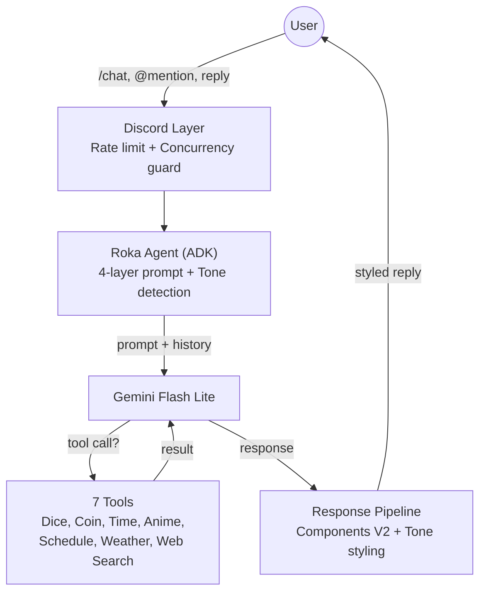
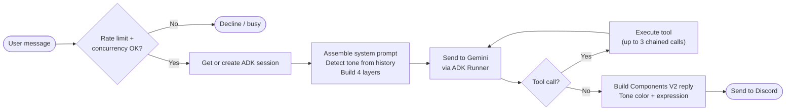
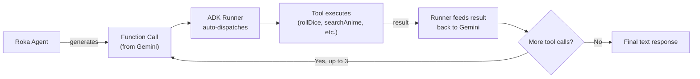
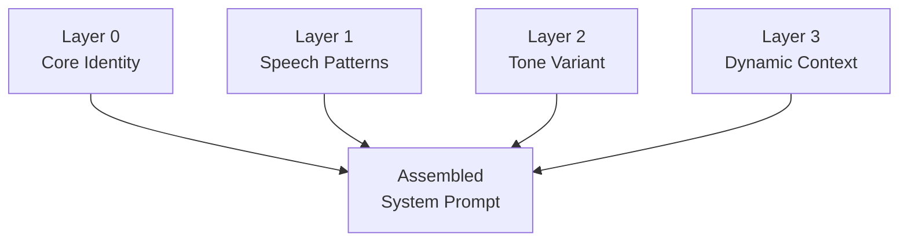
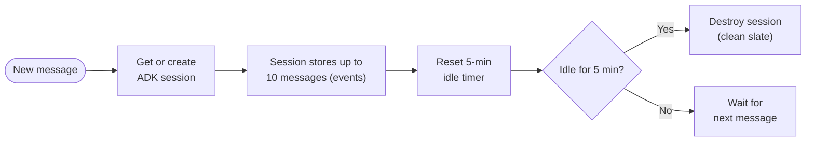
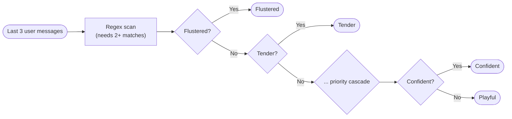

<p align="center">
  
</p>

<h1 align="center">Rokabot</h1>

<p align="center">
  A server-wide Discord character chatbot embodying <strong>Maniwa Roka</strong> from <em>Senren*Banka</em>,<br/>
  powered by Gemini Flash Lite via Google ADK TypeScript.
</p>

<p align="center">
  
  
  
  
  
</p>

---

Rokabot responds to `/chat` slash commands, @mentions, and replies with in-character dialogue. It can also perceive images attached to messages via Gemini's multimodal input. It maintains per-channel conversational memory using a 10-message sliding window with a 5-minute idle TTL. A 4-layer prompt system drives personality, speech patterns, dynamic tone selection, and channel awareness.

All state is in-memory with no persistence. Bot restart = clean slate.

## Features

- **Character roleplay** -- responds in-character as Maniwa Roka with personality-driven dialogue
- **Multiple triggers** -- `/chat` slash command, @mentions, and reply detection
- **Multimodal input** -- perceives images attached to messages (up to 4 MB each)
- **8 dynamic tones** -- rule-based tone detection (zero LLM cost) adjusts personality across playful, sincere, domestic, flustered, curious, annoyed, tender, and confident moods
- **7 agent tools** -- dice rolling, coin flip, timezone-aware clock, anime search, anime schedule, weather lookup, and web search (Tavily)
- **Standalone slash commands** -- `/roll_dice`, `/flip_coin`, `/time`, `/anime`, `/schedule`, `/weather`, `/search` with paginated results
- **Per-channel sessions** -- 10-message FIFO window with 5-minute idle TTL via ADK's InMemorySessionService
- **Rate limiting** -- dual token-bucket (RPM) + daily counter (RPD) guard
- **Concurrency guard** -- 1 active request per channel
- **Tone-styled responses** -- Components V2 replies with accent colors and character expressions per tone
- **Graceful shutdown** -- SIGTERM/SIGINT handling with session cleanup

---

## High-Level Architecture



<details>
<summary><strong>Request Pipeline</strong></summary>

How a user message flows through the system and becomes a styled, in-character reply:



</details>

<details>
<summary><strong>Tool Calling Flow</strong></summary>

The ADK Runner handles tool orchestration automatically. Tools are declared as `FunctionTool` instances with Zod schemas:



Tools available to the agent:

| Tool                 | Description                        | API                 |
| -------------------- | ---------------------------------- | ------------------- |
| `roll_dice`          | Roll NdM dice                      | Local               |
| `flip_coin`          | Coin flip                          | Local               |
| `get_current_time`   | Timezone-aware clock               | Local               |
| `search_anime`       | Anime search with filters          | Jikan (MyAnimeList) |
| `get_anime_schedule` | Airing schedule by day/week/season | Jikan (MyAnimeList) |
| `get_weather`        | Current weather for a city         | Open-Meteo          |
| `search_web`         | Web search (fallback tool)         | Tavily              |

</details>

<details>
<summary><strong>Prompt Assembly</strong></summary>

The system prompt is assembled from 4 layers, kept within a ~1000-1600 token budget:



- **Layer 0 (Core)** -- personality, background, behavioral rules
- **Layer 1 (Speech)** -- formatting rules, speech patterns, response length
- **Layer 2 (Tone)** -- one of 8 tone variants selected by the tone detector
- **Layer 3 (Context)** -- time of day, participant names, current user

</details>

<details>
<summary><strong>Session Management</strong></summary>

Sessions are per-channel, managed via ADK's `InMemorySessionService` with a custom windowed variant that caps event history:



</details>

<details>
<summary><strong>Tone Detection</strong></summary>

The tone detector evaluates the last 3 user messages against priority-ordered regular expressions, requiring at least 2 pattern matches to trigger a specific tone (zero LLM cost). Falls back to playful if no thresholds are met.



| Tone      | Color              | Expression Pool                   |
| --------- | ------------------ | --------------------------------- |
| Playful   | `#FFB3D9` pink     | smile, cheerful, delighted        |
| Sincere   | `#A8D8FF` blue     | sad, downcast, melancholy         |
| Domestic  | `#FFD4B5` peach    | gentle smile, content, serene     |
| Flustered | `#FFB3B3` red      | flustered, nervous, awkward       |
| Curious   | `#B2EBF2` cyan     | thinking, surprised, blank stare  |
| Annoyed   | `#F8B4B8` rose     | exasperated, frustrated, resigned |
| Tender    | `#E1BEE7` lavender | worried, troubled, gentle smile   |
| Confident | `#C8E6C9` mint     | composed, explaining, attentive   |

</details>

<details>
<summary><strong>Project Structure</strong></summary>

```
rokabot/
├── src/
│   ├── index.ts                       # Entry point, signal handling, graceful shutdown
│   ├── config.ts                      # Config loader (.env secrets + config.yml tunables)
│   ├── agent/
│   │   ├── roka.ts                    # ADK LlmAgent + Runner, session management
│   │   ├── toneDetector.ts            # Rule-based tone detection (keyword matching)
│   │   ├── promptAssembler.ts         # 4-layer prompt combiner
│   │   ├── prompts/
│   │   │   ├── core.ts                # Layer 0: Core identity & personality
│   │   │   ├── speech.ts              # Layer 1: Speech patterns & formatting rules
│   │   │   ├── tones.ts               # Layer 2: Tone variants (8 moods)
│   │   │   └── context.ts             # Layer 3: Dynamic context (time, participants)
│   │   └── tools/
│   │       ├── index.ts               # ADK FunctionTool declarations (Zod schemas)
│   │       ├── rollDice.ts            # NdM dice roller
│   │       ├── flipCoin.ts            # Coin flip
│   │       ├── getCurrentTime.ts      # Timezone-aware clock
│   │       ├── searchAnime.ts         # Jikan anime search (sort, filter, limit)
│   │       ├── getAnimeSchedule.ts    # Jikan schedule (day/week/season scope)
│   │       ├── getWeather.ts          # Open-Meteo weather lookup
│   │       ├── searchWeb.ts           # Tavily web search (fallback)
│   │       └── jikanThrottle.ts       # Jikan API rate limiter (3 req/s)
│   ├── discord/
│   │   ├── client.ts                  # discord.js client setup (intents, partials)
│   │   ├── concurrency.ts             # Per-channel concurrency guard
│   │   ├── responses.ts               # In-character message pools
│   │   ├── commands/
│   │   │   ├── chat.ts                # /chat slash command
│   │   │   └── tools.ts              # Tool slash commands (/anime, /schedule, etc.)
│   │   └── events/
│   │       ├── ready.ts               # Bot login, command registration
│   │       ├── interactionCreate.ts   # Slash command router
│   │       ├── messageCreate.ts       # @mention and reply handler
│   │       └── toolCommands.ts        # Tool command handlers + pagination
│   ├── session/
│   │   └── types.ts                   # WindowMessage & ChannelSession interfaces
│   └── utils/
│       ├── logger.ts                  # pino structured logger
│       └── rateLimiter.ts             # Token bucket (RPM) + daily counter (RPD)
├── scripts/
│   ├── test-chat.ts                   # CLI test script for rapid prompt iteration
│   └── test-adk-smoke.ts             # Automated ADK smoke test
├── assets/
│   ├── roka-character-bible.md        # Comprehensive character reference
│   └── app-icon.jpg                   # Bot avatar
├── config.yml                         # Tunable configuration (non-secret)
├── .env.example                       # Environment variable template
├── Dockerfile                         # Multi-stage build (build + slim runtime)
├── docker-compose.yml                 # Single service, 512 MB mem cap, log rotation
├── tsconfig.json                      # TypeScript compiler config
├── .eslintrc.cjs                      # ESLint config
├── .prettierrc                        # Prettier config
├── vitest.config.ts                   # Vitest test runner config
└── package.json                       # Dependencies & scripts
```

</details>

---

## Tech Stack

| Category        | Technology            | Notes                                         |
| --------------- | --------------------- | --------------------------------------------- |
| Language        | TypeScript (ES2022)   | Node16 module resolution                      |
| Runtime         | Node.js 24            | Alpine-based, ARM64 for RPi 5                 |
| Discord         | discord.js v14        | Guilds, GuildMessages, MessageContent intents |
| Agent Framework | @google/adk           | LlmAgent + Runner with FunctionTools          |
| LLM             | Gemini 3.1 Flash Lite | `gemini-3.1-flash-lite-preview`               |
| Validation      | Zod                   | Tool parameter schemas                        |
| Logging         | pino                  | Structured JSON, pino-pretty in dev           |
| Testing         | vitest                | TypeScript-native                             |
| Deployment      | Docker Compose        | Multi-stage build, node:24-alpine             |

---

## Getting Started

### Prerequisites

- **Node.js** >= 24.13.0
- **Docker + Docker Compose** (for containerized deployment)
- A [Discord Bot Token + Client ID](https://discord.com/developers/applications) with the **Message Content** privileged intent enabled
- A [Gemini API Key](https://aistudio.google.com/apikey)
- (Optional) A [Tavily API Key](https://tavily.com) for web search

### Installation

```bash
git clone https://github.com/AlaskanTuna/rokabot.git
cd rokabot
npm ci
```

### Configure secrets

```bash
cp .env.example .env
```

Edit `.env` with your credentials:

```env
DISCORD_TOKEN=your_discord_bot_token
DISCORD_CLIENT_ID=your_discord_client_id
GEMINI_API_KEY=your_gemini_api_key
TAVILY_API_KEY=your_tavily_api_key  # optional
```

### Configure tunables (optional)

Edit `config.yml` to adjust rate limits, session behavior, model, timezone, or logging level. Environment variables can override any YAML value.

### Run

**Development (hot reload):**

```bash
npm run dev          # full ADK logging
npm run dev:quiet    # suppresses verbose ADK event dumps
```

**Production (compiled):**

```bash
npm run build
npm start
```

**Docker:**

```bash
docker compose up -d
```

---

## Configuration

Secrets live in `.env`, tunables live in `config.yml`.

| YAML Path                  | Env Override                 | Default                         | Description                       |
| -------------------------- | ---------------------------- | ------------------------------- | --------------------------------- |
| `gemini.model`             | `GEMINI_MODEL`               | `gemini-3.1-flash-lite-preview` | Gemini model name                 |
| `gemini.timeout`           | `GEMINI_TIMEOUT`             | `25000`                         | Request timeout (ms)              |
| `gemini.maxRetries`        | `GEMINI_MAX_RETRIES`         | `1`                             | Max retries for transient errors  |
| `gemini.maxOutputTokens`   | `GEMINI_MAX_OUTPUT_TOKENS`   | `500`                           | Max output tokens (safety net)    |
| `rateLimit.rpm`            | `RATE_LIMIT_RPM`             | `15`                            | Requests per minute               |
| `rateLimit.rpd`            | `RATE_LIMIT_RPD`             | `500`                           | Requests per day                  |
| `session.ttl`              | `SESSION_TTL_MS`             | `300000`                        | Idle session TTL (ms)             |
| `session.windowSize`       | `SESSION_WINDOW_SIZE`        | `10`                            | FIFO message window size          |
| `discord.maxMessageLength` | `DISCORD_MAX_MESSAGE_LENGTH` | `2000`                          | Discord message char limit        |
| `timezone`                 | `TZ`                         | —                               | IANA timezone (e.g. `Asia/Tokyo`) |
| `logging.level`            | `LOG_LEVEL`                  | `info`                          | Log level (debug/info/warn/error) |

---

## Commands

```bash
# Development
npm run dev            # Start with tsx watch (hot reload)
npm run dev:quiet      # Same, but suppresses verbose ADK event logs
npm run test:chat      # CLI chat test (no Discord needed)
npm run test:smoke     # Automated ADK smoke test

# Build & Run
npm run build          # Compile TypeScript to dist/
npm start              # Run compiled JS (production)

# Quality
npm run lint           # ESLint
npm run format         # Prettier (write)
npm run format:check   # Prettier (check only)
npm test               # Run all tests
npm run test:watch     # Tests in watch mode

# Docker
docker compose build   # Build image
docker compose up -d   # Run containerized
docker compose logs -f # Tail logs
```

---

## Docker Deployment

The Dockerfile uses a multi-stage build: stage 1 compiles TypeScript with all dev dependencies, stage 2 copies only the compiled output and production dependencies into a slim `node:24-alpine` image.

```bash
docker compose up -d
```

| Setting          | Value             |
| ---------------- | ----------------- |
| Base image       | `node:24-alpine`  |
| Memory limit     | 512 MB            |
| Expected runtime | ~80-150 MB        |
| Restart policy   | `unless-stopped`  |
| Log rotation     | 10 MB x 3 files   |
| Process user     | `node` (non-root) |

The image builds natively on ARM64 (Raspberry Pi 5) with no cross-compilation needed.

---

## License

MIT. 2026.
