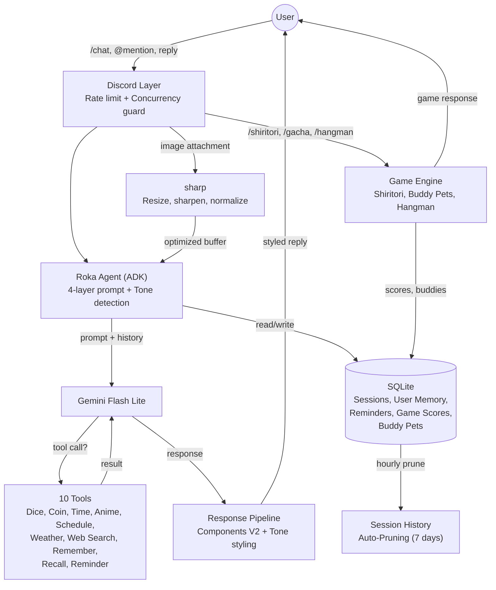
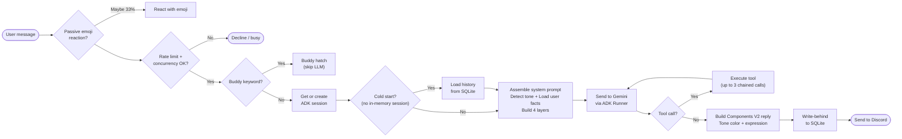
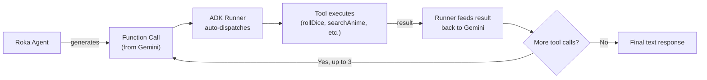
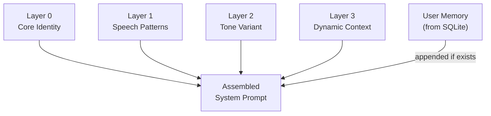
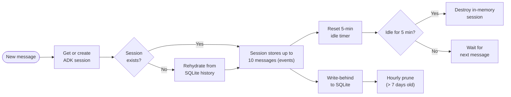
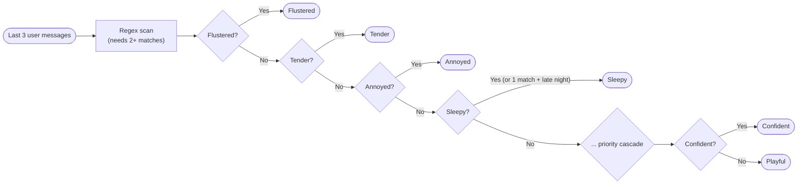
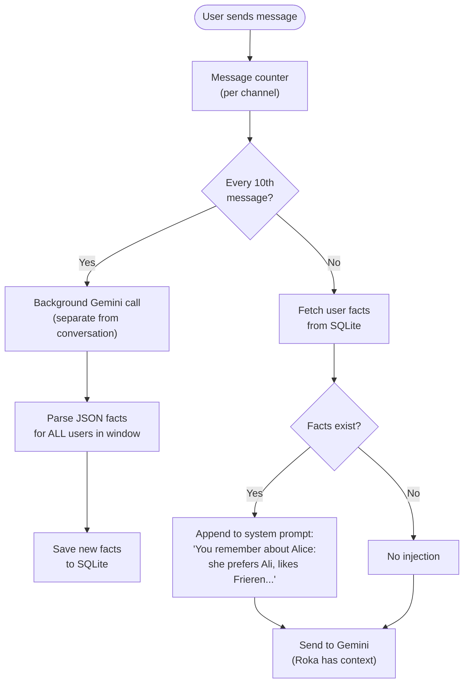
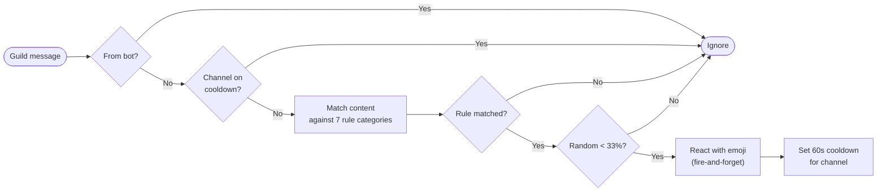
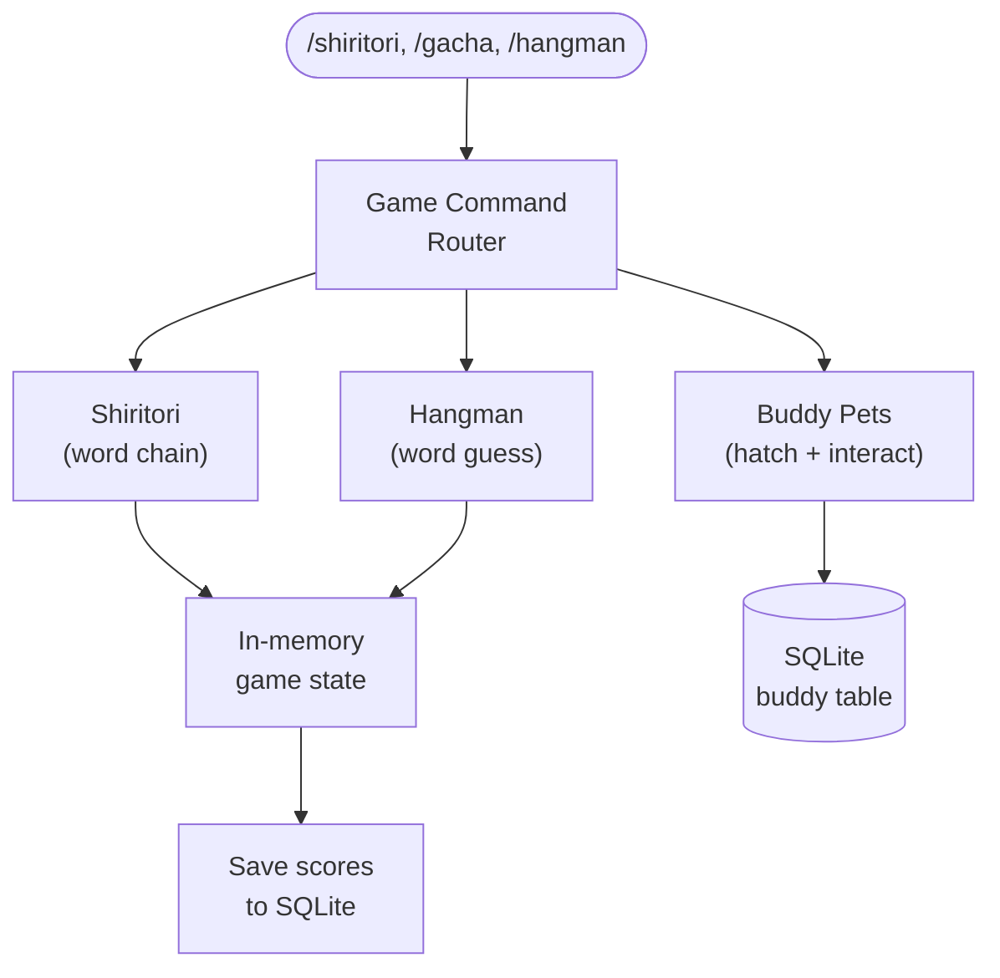

<p align="center">
  
</p>

<h1 align="center">Rokabot</h1>

<p align="center">
  A server-wide Discord character chatbot embodying <strong>Maniwa Roka</strong> from <em>Senren*Banka</em>,<br/>
  powered by Gemini Flash Lite via Google ADK TypeScript.
</p>

<p align="center">
  
  
  
  
  
</p>

---

Rokabot responds to `/chat` slash commands, @mentions, and replies with in-character dialogue. It can also perceive images attached to messages via Gemini's multimodal input. It maintains per-channel conversational memory using a 10-message sliding window with a 5-minute idle TTL, backed by SQLite for persistence across restarts. A 4-layer prompt system drives personality, speech patterns, dynamic tone selection, and channel awareness.

## Features

- **In-character roleplay** -- Maniwa Roka personality with 12 dynamic tones and Components V2 styled responses
- **Multiple triggers** -- `/chat`, @mentions, replies (with poll, forward, and sticker context), and image perception
- **Image pre-processing** -- `sharp`-based resize, sharpen, and normalize pipeline for optimal Gemini vision input
- **10 agent tools** -- dice, coin, clock, anime search, schedule, weather, web search, user memory, reminders
- **3 mini-games** -- `/shiritori`, `/gacha` (buddy pets), `/hangman` with leaderboards and guides
- **Buddy pet system** -- hatch a deterministic VN companion spirit (18 species, 5 rarity tiers, 5 stats)
- **Per-user memory** -- remembers nicknames, favorites, and personal details across sessions via background extraction every 10 messages
- **Reminders** -- set via conversation or `/remind` command, with timezone-aware scheduling and DM fallback
- **SQLite persistence** -- sessions, memory, reminders, and game scores survive restarts
- **Session history auto-pruning** -- hourly cleanup of history older than 7 days
- **Passive emoji reactions** -- contextual emoji reactions on guild messages (probability-gated)
- **Dynamic status** -- bot presence cycles through time-of-day activities every 15 minutes

---

## High-Level Architecture



<details>
<summary><strong>Request Pipeline</strong></summary>

How a user message flows through the system and becomes a styled, in-character reply:



</details>

<details>
<summary><strong>Tool Calling Flow</strong></summary>

The ADK Runner handles tool orchestration automatically. Tools are declared as `FunctionTool` instances with Zod schemas:



Tools available to the agent:

| Tool                 | Description               | Example                        | API        |
| -------------------- | ------------------------- | ------------------------------ | ---------- |
| `roll_dice`          | Roll NdM dice             | "Roll 2d20 for me"             | Local      |
| `flip_coin`          | Coin flip                 | "Flip a coin"                  | Local      |
| `get_current_time`   | Timezone-aware clock      | "What time is it in Tokyo?"    | Local      |
| `search_anime`       | Anime search with filters | "Tell me about Frieren"        | Jikan      |
| `get_anime_schedule` | Airing schedule           | "What anime airs on Friday?"   | Jikan      |
| `get_weather`        | Current weather           | "How's the weather in London?" | Open-Meteo |
| `search_web`         | Web search (fallback)     | "Latest One Piece news"        | Tavily     |
| `remember_user`      | Remember user facts       | "My favorite anime is Frieren" | SQLite     |
| `recall_user`        | Recall user facts         | "What do you know about me?"   | SQLite     |
| `set_reminder`       | Timed reminders           | "Remind me to eat at 3pm"      | SQLite     |

</details>

<details>
<summary><strong>Prompt Assembly</strong></summary>

The system prompt is assembled from 4 layers, kept within a ~1000-1800 token budget:



- **Layer 0 (Core)** -- personality, background, behavioral rules, abilities
- **Layer 1 (Speech)** -- formatting rules, speech patterns, response length
- **Layer 2 (Tone)** -- one of 12 tone variants selected by the tone detector
- **Layer 3 (Context)** -- time of day, participant names, current user
- **User Memory** -- per-user facts appended when available (e.g., nickname, favorite anime)

</details>

<details>
<summary><strong>Session & Persistence</strong></summary>

Sessions are per-channel, with in-memory ADK sessions as the hot path and SQLite as persistent backing store. Session history older than 7 days is automatically pruned on an hourly interval.



SQLite tables:

| Table             | Purpose                                    |
| ----------------- | ------------------------------------------ |
| `session_history` | Conversation messages for rehydration      |
| `user_memory`     | Per-user facts (max 10 per user)           |
| `reminders`       | Scheduled reminders with delivery tracking |
| `game_scores`     | Shiritori and hangman scores               |
| `buddy`           | Per-user companion spirit data and stats   |

</details>

<details>
<summary><strong>Tone Detection</strong></summary>

The tone detector evaluates the last 3 user messages against priority-ordered regular expressions, requiring at least 2 pattern matches to trigger a specific tone (zero LLM cost). The `sleepy` tone has a special late-night trigger (22:00-04:00) that lowers the threshold to 1 match. Falls back to playful if no thresholds are met.



| Tone        | Color                | Expression Pool                           | Trigger                        |
| ----------- | -------------------- | ----------------------------------------- | ------------------------------ |
| Playful     | `#FFB3D9` pink       | smile, cheerful                           | Default fallback               |
| Sincere     | `#A8D8FF` blue       | sad, pained, sorrowful                    | Emotional keywords             |
| Domestic    | `#FFD4B5` peach      | content, gentle smile, relieved           | Food/cooking/home keywords     |
| Flustered   | `#FFB3B3` red        | flustered, nervous, awkward               | Romantic keywords              |
| Curious     | `#B2EBF2` cyan       | thinking, surprised, blank stare          | Question words                 |
| Annoyed     | `#F8B4B8` rose       | exasperated, dissatisfied, dissatisfied 2 | Defiance/recklessness keywords |
| Tender      | `#E1BEE7` lavender   | worried, troubled, anxious                | Soft vulnerability keywords    |
| Confident   | `#C8E6C9` mint       | composed, base, explaining                | Help/advice/trust keywords     |
| Nostalgic   | `#D4A574` amber      | melancholy, downcast, somber              | Memory/past keywords           |
| Mischievous | `#FFD700` gold       | delighted, attentive                      | Scheming/prank keywords        |
| Sleepy      | `#B0C4DE` steel blue | serene, resigned                          | Sleep keywords + late night    |
| Competitive | `#FF6B6B` fiery red  | frustrated, dissatisfied 3, uncertain     | Game/challenge keywords        |

All 33 character expressions are assigned uniquely across tones — no expression appears in more than one pool.

</details>

<details>
<summary><strong>Per-User Relationship Memory</strong></summary>

Roka remembers facts about individual users across sessions. Facts are extracted passively via a background process and also available through explicit ADK tools.



**How it works:**

- **Background extraction**: Every 10 messages in a channel, the conversation window is sent to a separate Gemini call (not through the ADK session) with a focused extraction prompt. This extracts facts for ALL users in the window — not just the current speaker.
- **Prompt injection**: When a user speaks, their stored facts are fetched from SQLite and appended to the system prompt (~50-100 tokens). Roka "just knows" these things.
- **Explicit tools**: `remember_user` and `recall_user` ADK tools are still available for direct @mention requests like "remember that my birthday is March 15" or "what do you know about me."
- **User ID auto-injection**: Discord user IDs are resolved automatically — the LLM never needs to know them.
- Facts are capped at 10 per user. When a new fact exceeds the cap, the oldest is evicted.
- Facts persist across bot restarts via SQLite.

| Aspect             | Detail                                                                              |
| ------------------ | ----------------------------------------------------------------------------------- |
| Storage            | SQLite `user_memory` table (user_id, fact_key, fact_value, updated_at)              |
| Cap                | 10 facts per user, oldest evicted on overflow                                       |
| Passive extraction | Every 10 messages, background Gemini call (~1 extra RPM per 10 msgs)                |
| Prompt injection   | Appended to system prompt at request time, ~50-100 tokens                           |
| Explicit tools     | `remember_user` (save), `recall_user` (recall), `list_reminders`, `cancel_reminder` |
| Deduplication      | Skips saving if identical key+value already exists                                  |

</details>

<details>
<summary><strong>Passive Emoji Reactions</strong></summary>

Roka passively reacts to messages with contextually appropriate emoji, even when not directly addressed. This runs on every guild message with zero LLM cost — purely rule-based keyword matching with a probability gate and cooldown.



**Reaction rules** (checked in priority order):

| Category    | Keywords                                             | Emoji Pool     |
| ----------- | ---------------------------------------------------- | -------------- |
| Compliments | cute, pretty, beautiful, best girl, adorable, lovely | `💕`           |
| Greetings   | good morning, ohayo, hello, konnichiwa, tadaima      | `👋`           |
| Goodnight   | goodnight, oyasumi, going to sleep, good night       | `🌙`           |
| Sadness     | sad, lonely, crying, feel bad, depressed             | `🫂`           |
| Food        | cook, recipe, hungry, eat, delicious, food, dinner   | `🍳` `🍵` `🍙` |
| Anime       | anime, manga, otaku, waifu, sensei, kawaii           | `✨` `🌸`      |
| Excitement  | let's go, woohoo, amazing, awesome, yay, congrats    | `🎉` `✨`      |

**Safeguards:**

- **Probability gate**: only 33% chance of reacting even when a rule matches
- **Cooldown**: max 1 reaction per channel per 60 seconds
- **Bot-aware**: never reacts to bot messages
- **Non-blocking**: reactions are fire-and-forget, never delay message handling

</details>

<details>
<summary><strong>Mini-Games</strong></summary>

Three built-in mini-games with slash command interfaces:



| Game       | Command      | Description                                                                                                   |
| ---------- | ------------ | ------------------------------------------------------------------------------------------------------------- |
| Shiritori  | `/shiritori` | Word chain game. Each word must start with the last letter of the previous. Multi-player, turn-based, scored. |
| Buddy Pets | `/gacha`     | Hatch a deterministic VN companion spirit with 18 species across 5 rarity tiers and 5 stats.                  |
| Hangman    | `/hangman`   | Classic word guessing with ~120 anime/VN/Japanese-culture terms. 6 lives, emoji gallows art.                  |

- Buddy pets can also be triggered via @mention with keywords: `gacha`, `draw`, `buddy`, `hatch`
- Shiritori and hangman have 120-second auto-timeout per turn
- Scores persist to SQLite across restarts

</details>

<details>
<summary><strong>Slash Commands Reference</strong></summary>

| Command              | Description                                                          |
| -------------------- | -------------------------------------------------------------------- |
| `/chat`              | Start a conversation with Roka                                       |
| `/roll_dice`         | Roll NdM dice                                                        |
| `/flip_coin`         | Flip a coin                                                          |
| `/time`              | Timezone-aware clock                                                 |
| `/weather`           | Current weather by city                                              |
| `/search`            | Web search                                                           |
| `/anime search`      | Search anime by name                                                 |
| `/anime browse`      | Browse anime by filters                                              |
| `/schedule search`   | Look up a specific anime schedule                                    |
| `/schedule browse`   | Browse airing schedule                                               |
| `/remind in`         | Set a timer-based reminder                                           |
| `/remind at`         | Set a reminder for a specific time                                   |
| `/remind list`       | View active reminders                                                |
| `/remind cancel`     | Cancel a reminder by ID                                              |
| `/shiritori`         | Word chain game (start, join, play, end, scores, guide, leaderboard) |
| `/hangman`           | Word guessing game (start, guess, guide, leaderboard)                |
| `/gacha hatch`       | Hatch your companion spirit                                          |
| `/gacha view`        | View your companion                                                  |
| `/gacha pet`         | Interact with your companion                                         |
| `/gacha stats`       | View companion's detailed stats                                      |
| `/gacha guide`       | Learn about the companion system                                     |
| `/gacha leaderboard` | View top companions by stats                                         |

</details>

<details>
<summary><strong>Project Structure</strong></summary>

```
rokabot/
├── src/
│   ├── index.ts                       # Entry point, signal handling, graceful shutdown
│   ├── config.ts                      # Config loader (.env secrets + config.yml tunables)
│   ├── agent/
│   │   ├── roka.ts                    # ADK LlmAgent + Runner, session management, SQLite integration
│   │   ├── toneDetector.ts            # Rule-based tone detection (keyword matching, 12 tones)
│   │   ├── promptAssembler.ts         # 4-layer prompt combiner
│   │   ├── memoryExtractor.ts        # Background fact extraction (every 10 messages)
│   │   ├── prompts/
│   │   │   ├── core.ts                # Layer 0: Core identity, personality, abilities
│   │   │   ├── speech.ts              # Layer 1: Speech patterns & formatting rules
│   │   │   ├── tones.ts               # Layer 2: Tone variants (12 moods)
│   │   │   └── context.ts             # Layer 3: Dynamic context (time, participants)
│   │   └── tools/
│   │       ├── index.ts               # ADK FunctionTool declarations (Zod schemas)
│   │       ├── rollDice.ts            # NdM dice roller
│   │       ├── flipCoin.ts            # Coin flip
│   │       ├── getCurrentTime.ts      # Timezone-aware clock
│   │       ├── searchAnime.ts         # Jikan anime search (sort, filter, limit)
│   │       ├── getAnimeSchedule.ts    # Jikan schedule (day/week/season scope)
│   │       ├── getWeather.ts          # Open-Meteo weather lookup
│   │       ├── searchWeb.ts           # Tavily web search (fallback)
│   │       ├── rememberUser.ts        # Remember a fact about a user (SQLite)
│   │       ├── recallUser.ts          # Recall stored facts about a user (SQLite)
│   │       ├── setReminder.ts         # Set a timed reminder for a user (SQLite)
│   │       └── jikanThrottle.ts       # Jikan API rate limiter (3 req/s)
│   ├── discord/
│   │   ├── client.ts                  # discord.js client setup (intents, partials)
│   │   ├── concurrency.ts             # Per-channel concurrency guard
│   │   ├── emojiReactor.ts            # Passive emoji reactions (rule-based, probability-gated)
│   │   ├── reminderScheduler.ts       # 60-second interval reminder delivery
│   │   ├── statusCycler.ts            # Dynamic bot status cycling (time-of-day)
│   │   ├── responses.ts               # In-character message pools
│   │   ├── messageBuilder.ts          # Components V2 message builder
│   │   ├── expressions.ts             # Tone → expression mapping
│   │   ├── toneStyles.ts              # Tone → color/image mapping
│   │   ├── commands/
│   │   │   ├── chat.ts                # /chat slash command
│   │   │   ├── tools.ts               # Tool slash commands (/anime, /schedule, etc.)
│   │   │   └── games.ts               # Game slash commands (/shiritori, /gacha, /hangman)
│   │   └── events/
│   │       ├── ready.ts               # Bot login, command registration
│   │       ├── interactionCreate.ts   # Slash command router
│   │       ├── messageCreate.ts       # @mention and reply handler + passive reactions
│   │       ├── toolCommands.ts        # Tool command handlers + pagination
│   │       ├── gameCommands.ts        # Game command handlers (shiritori, gacha, hangman)
│   │       └── gachaMention.ts        # Gacha @mention keyword handler
│   ├── games/
│   │   ├── shiritori.ts               # Shiritori game state manager
│   │   ├── buddy.ts                   # Buddy pet system (hatch, pet, stats, leaderboard)
│   │   ├── hangman.ts                 # Hangman game state manager
│   │   └── data/
│   │       ├── wordlist.json          # ~5700 English words for shiritori validation
│   │       ├── buddySpecies.ts        # 18 species across 5 rarity tiers with stats
│   │       └── hangmanWords.ts        # ~120 anime/VN/Japanese-culture terms with hints
│   ├── storage/
│   │   ├── database.ts                # SQLite initialization, schema, singleton
│   │   ├── sessionStore.ts            # Session history persistence (write-behind, load)
│   │   ├── userMemory.ts              # Per-user fact storage (CRUD, 10-fact cap)
│   │   └── reminderStore.ts           # Reminder CRUD (5-reminder cap per user)
│   ├── session/
│   │   ├── types.ts                   # WindowMessage & ChannelSession interfaces
│   │   ├── messageWindow.ts           # FIFO message window
│   │   └── sessionManager.ts          # Session lifecycle manager
│   └── utils/
│       ├── logger.ts                  # pino structured logger
│       ├── rateLimiter.ts             # Token bucket (RPM) + daily counter (RPD)
│       └── imageProcessor.ts          # sharp-based image pre-processing for Gemini vision
├── scripts/
│   ├── test-chat.ts                   # CLI test script for rapid prompt iteration
│   ├── test-adk-smoke.ts              # Automated ADK smoke test (tools, response quality)
│   └── test-features.ts              # Phase 7 feature integration test
├── assets/
│   ├── roka-character-bible.md        # Comprehensive character reference
│   └── app-icon.jpg                   # Bot avatar
├── config.yml                         # Tunable configuration (non-secret)
├── .env.example                       # Environment variable template
├── Dockerfile                         # Multi-stage build (build + slim runtime)
├── docker-compose.yml                 # Single service, 512 MB mem cap, log rotation, SQLite volume
├── tsconfig.json                      # TypeScript compiler config
├── .eslintrc.cjs                      # ESLint config
├── .prettierrc                        # Prettier config
├── vitest.config.ts                   # Vitest test runner config
└── package.json                       # Dependencies & scripts
```

</details>

---

## Tech Stack

| Category        | Technology            | Notes                                         |
| --------------- | --------------------- | --------------------------------------------- |
| Language        | TypeScript (ES2022)   | Node16 module resolution                      |
| Runtime         | Node.js 24            | Alpine-based, ARM64 for RPi 5                 |
| Discord         | discord.js v14        | Guilds, GuildMessages, MessageContent intents |
| Agent Framework | @google/adk           | LlmAgent + Runner with FunctionTools          |
| LLM             | Gemini 3.1 Flash Lite | `gemini-3.1-flash-lite-preview`               |
| Database        | better-sqlite3        | Synchronous SQLite for persistence            |
| Image           | sharp                 | Resize, sharpen, normalize for Gemini vision  |
| Validation      | Zod                   | Tool parameter schemas                        |
| Logging         | pino                  | Structured JSON, pino-pretty in dev           |
| Testing         | vitest                | 314 tests, TypeScript-native                  |
| Deployment      | Docker Compose        | Multi-stage build, node:24-alpine             |

---

## Getting Started

### Prerequisites

- **Node.js** >= 24.13.0
- **Docker + Docker Compose** (for containerized deployment)
- A [Discord Bot Token + Client ID](https://discord.com/developers/applications) with the **Message Content** privileged intent enabled
- A [Gemini API Key](https://aistudio.google.com/apikey)
- (Optional) A [Tavily API Key](https://tavily.com) for web search

### Installation

```bash
git clone https://github.com/AlaskanTuna/rokabot.git
cd rokabot
npm ci
```

### Configure secrets

```bash
cp .env.example .env
```

Edit `.env` with your credentials:

```env
DISCORD_TOKEN=your_discord_bot_token
DISCORD_CLIENT_ID=your_discord_client_id
GEMINI_API_KEY=your_gemini_api_key
TAVILY_API_KEY=your_tavily_api_key  # optional
```

### Configure tunables (optional)

Edit `config.yml` to adjust rate limits, session behavior, model, timezone, or logging level. Environment variables can override any YAML value.

### Run

**Development (hot reload):**

```bash
npm run dev          # full ADK logging
npm run dev:quiet    # suppresses verbose ADK event dumps
```

**Production (compiled):**

```bash
npm run build
npm start
```

**Docker:**

```bash
docker compose up -d
```

---

## Configuration

Secrets live in `.env`, tunables live in `config.yml`.

| YAML Path                  | Env Override                 | Default                         | Description                       |
| -------------------------- | ---------------------------- | ------------------------------- | --------------------------------- |
| `gemini.model`             | `GEMINI_MODEL`               | `gemini-3.1-flash-lite-preview` | Gemini model name                 |
| `gemini.timeout`           | `GEMINI_TIMEOUT`             | `25000`                         | Request timeout (ms)              |
| `gemini.maxRetries`        | `GEMINI_MAX_RETRIES`         | `1`                             | Max retries for transient errors  |
| `gemini.maxOutputTokens`   | `GEMINI_MAX_OUTPUT_TOKENS`   | `500`                           | Max output tokens (safety net)    |
| `rateLimit.rpm`            | `RATE_LIMIT_RPM`             | `15`                            | Requests per minute               |
| `rateLimit.rpd`            | `RATE_LIMIT_RPD`             | `500`                           | Requests per day                  |
| `session.ttl`              | `SESSION_TTL_MS`             | `300000`                        | Idle session TTL (ms)             |
| `session.windowSize`       | `SESSION_WINDOW_SIZE`        | `10`                            | FIFO message window size          |
| `discord.maxMessageLength` | `DISCORD_MAX_MESSAGE_LENGTH` | `2000`                          | Discord message char limit        |
| `timezone`                 | `TZ`                         | --                              | IANA timezone (e.g. `Asia/Tokyo`) |
| `logging.level`            | `LOG_LEVEL`                  | `info`                          | Log level (debug/info/warn/error) |

---

## Commands

```bash
# Development
npm run dev            # Start with tsx watch (hot reload)
npm run dev:quiet      # Same, but suppresses verbose ADK event logs
npm run test:chat      # CLI chat test (no Discord needed)
npm run test:smoke     # Automated ADK smoke test
npm run test:features  # Phase 7 feature integration test

# Build & Run
npm run build          # Compile TypeScript to dist/
npm start              # Run compiled JS (production)

# Quality
npm run lint           # ESLint
npm run format         # Prettier (write)
npm run format:check   # Prettier (check only)
npm test               # Run all tests (314 tests)
npm run test:watch     # Tests in watch mode

# Docker
docker compose build   # Build image
docker compose up -d   # Run containerized
docker compose logs -f # Tail logs
```

---

## Docker Deployment

The Dockerfile uses a multi-stage build: stage 1 compiles TypeScript with all dev dependencies, stage 2 copies only the compiled output and production dependencies into a slim `node:24-alpine` image. Builds natively on ARM64 (Raspberry Pi 5) with no cross-compilation needed. SQLite data is persisted via a Docker volume mount.

| Setting          | Value                          |
| ---------------- | ------------------------------ |
| Base image       | `node:24-alpine`               |
| Memory limit     | 512 MB                         |
| Measured runtime | ~46 MB                         |
| Restart policy   | `unless-stopped`               |
| Log rotation     | 10 MB x 3 files                |
| Process user     | `node` (non-root)              |
| Data persistence | `./data:/app/data` (SQLite DB) |

```bash
# Build and start (first time or after code changes)
docker compose up -d --build

# View logs
docker compose -f ~/rokabot/docker-compose.yml logs -f

# Restart the bot
docker compose restart

# Stop the bot
docker compose down

# Check memory/CPU usage
docker stats --no-stream

# Deploy latest changes from GitHub
cd ~/rokabot && git pull && docker compose up -d --build
```

---

## License

MIT. 2026.
