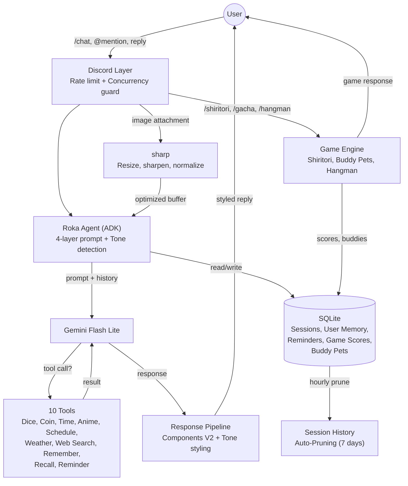
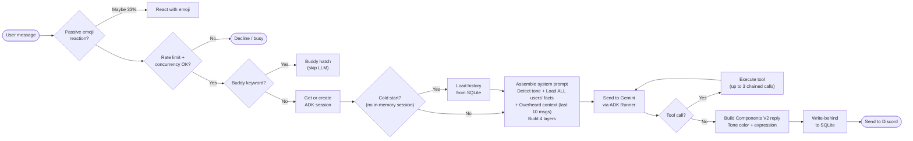
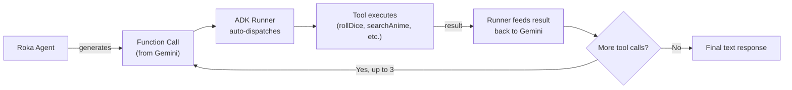
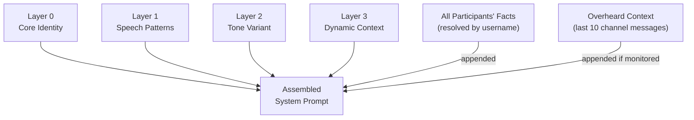
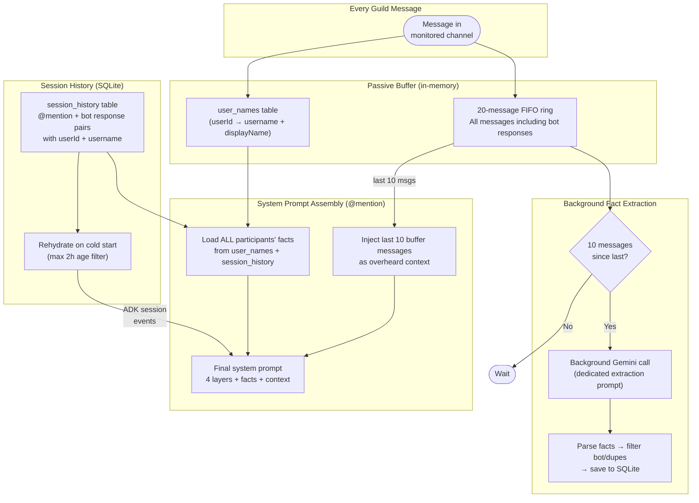

<p align="center">
  
</p>

<h1 align="center">Rokabot</h1>

<p align="center">
  A server-wide Discord character chatbot embodying <strong>Maniwa Roka</strong> from <em>Senren*Banka</em>,<br/>
  powered by Gemini Flash Lite via Google ADK TypeScript.
</p>

<p align="center">
  
  
  
  
  
</p>

---

Rokabot responds to `/chat` slash commands, @mentions, and replies with in-character dialogue. It can also perceive images attached to messages via Gemini's multimodal input. It maintains per-channel conversational memory using a 20-message sliding window with idle TTL, backed by SQLite for persistence across restarts. Monitored channels also inject overheard context — Roka passively reads recent messages even when not directly addressed. A 4-layer prompt system drives personality, speech patterns, dynamic tone selection, and channel awareness.

## Features

- **In-character roleplay**: Maniwa Roka personality with 12 dynamic tones and Components V2 styled responses.
- **Channel-aware**: Passively monitors conversations, injects overheard context, and loads facts for all participants so Roka knows what's happening around her.
- **Per-user memory**: Background fact extraction with cross-server identity resolution via Discord username.
- **10 agent tools**: Dice, coin, clock, anime/schedule search, weather, web search, user memory, reminders.
- **3 mini-games**: Shiritori, buddy pets (18 species, 5 rarity tiers), hangman with leaderboards.
- **SQLite persistence**: Sessions, memory, reminders, and game scores survive restarts.

---

## High-Level Architecture



<details>
<summary><strong>Request Pipeline</strong></summary>

How a user message flows through the system and becomes a styled, in-character reply:



</details>

<details>
<summary><strong>Tool Calling Flow</strong></summary>

The ADK Runner handles tool orchestration automatically. Tools are declared as `FunctionTool` instances with Zod schemas:



Tools available to the agent:

| Tool                 | Description               | Example                        | API        |
| -------------------- | ------------------------- | ------------------------------ | ---------- |
| `roll_dice`          | Roll NdM dice             | "Roll 2d20 for me"             | Local      |
| `flip_coin`          | Coin flip                 | "Flip a coin"                  | Local      |
| `get_current_time`   | Timezone-aware clock      | "What time is it in Tokyo?"    | Local      |
| `search_anime`       | Anime search with filters | "Tell me about Frieren"        | Jikan      |
| `get_anime_schedule` | Airing schedule           | "What anime airs on Friday?"   | Jikan      |
| `get_weather`        | Current weather           | "How's the weather in London?" | Open-Meteo |
| `search_web`         | Web search (fallback)     | "Latest One Piece news"        | Tavily     |
| `remember_user`      | Remember user facts       | "My favorite anime is Frieren" | SQLite     |
| `recall_user`        | Recall user facts         | "What do you know about me?"   | SQLite     |
| `set_reminder`       | Timed reminders           | "Remind me to eat at 3pm"      | SQLite     |

</details>

<details>
<summary><strong>Prompt Assembly</strong></summary>

The system prompt is assembled from 4 layers, kept within a ~1000-1800 token budget:



- **Layer 0 (Core)**: Personality, background, behavioral rules, abilities.
- **Layer 1 (Speech)**: Formatting rules, speech patterns, response length.
- **Layer 2 (Tone)**: One of 12 tone variants selected by the tone detector.
- **Layer 3 (Context)**: Time of day, participant names, current user.
- **User Facts**: Facts for all known channel participants, labeled as `username (DisplayName)` for cross-server identity.
- **Overheard Context**: Last 10 messages from the passive buffer so Roka knows what's happening around her.

</details>

<details>
<summary><strong>Channel Awareness & Memory Architecture</strong></summary>

Three interconnected systems give Roka awareness of conversations, people, and context. Each handles a different scope of information:



**Session persistence**: @mention interactions and bot responses are saved to `session_history` with userId and username. On cold start, up to 20 messages are rehydrated (max 2h age to prevent stale context contamination). Sessions idle-timeout and auto-destroy.

**Passive buffer**: All messages in monitored channels flow into a 20-message in-memory **FIFO ring**. Serves two purposes: overheard context injection (last 10 messages into the system prompt) and feeding the background fact extractor. Also persists `userId → username + displayName` mappings to SQLite for cross-server identity resolution.

**Fact extraction**: Every 10 messages, a background Gemini call extracts personal facts (interests, habits, preferences, identity) for all users in the buffer. Facts are stored by userId, labeled by username in the prompt.

**Prompt injection**: When responding, ALL known users' facts are loaded (not just the current speaker), resolved from `user_names` table + `session_history` + current interaction. Labeled as `username (DisplayName)` for cross-server matching.

| SQLite Table      | Purpose                                                    |
| ----------------- | ---------------------------------------------------------- |
| `session_history` | Conversation messages with userId/username for rehydration |
| `user_memory`     | Per-user facts                                             |
| `user_names`      | Persistent userId → username + displayName mappings        |
| `reminders`       | Scheduled reminders with delivery tracking                 |
| `game_scores`     | Shiritori and hangman scores                               |
| `buddy`           | Per-user companion spirit data and stats                   |

</details>

<details>
<summary><strong>Tone Detection</strong></summary>

Rule-based keyword matching on the last 3 user messages (zero LLM cost). 12 tones with priority-ordered regex patterns — needs 2+ matches to trigger, falls back to playful. Each tone has a unique accent color and expression pool (33 expressions total). The `sleepy` tone has a special late-night trigger (22:00-04:00).

| Tone      | Color           | Tone        | Color                |
| --------- | --------------- | ----------- | -------------------- |
| Playful   | `#FFB3D9` pink  | Confident   | `#C8E6C9` mint       |
| Sincere   | `#A8D8FF` blue  | Nostalgic   | `#D4A574` amber      |
| Domestic  | `#FFD4B5` peach | Mischievous | `#FFD700` gold       |
| Flustered | `#FFB3B3` red   | Sleepy      | `#B0C4DE` steel blue |
| Curious   | `#B2EBF2` cyan  | Competitive | `#FF6B6B` fiery red  |
| Annoyed   | `#F8B4B8` rose  | Tender      | `#E1BEE7` lavender   |

</details>

<details>
<summary><strong>Passive Emoji Reactions</strong></summary>

Rule-based keyword matching with a probability gate and per-channel cooldown. Zero LLM cost. 7 categories (compliments, greetings, goodnight, sadness, food, anime, excitement) with contextual emoji pools. 33% reaction probability, configurable cooldown, fire-and-forget.

</details>

<details>
<summary><strong>Mini-Games</strong></summary>

Three built-in mini-games with slash command interfaces:


| Game       | Command      | Description                                                                                                   |
| ---------- | ------------ | ------------------------------------------------------------------------------------------------------------- |
| Shiritori  | `/shiritori` | Word chain game. Each word must start with the last letter of the previous. Multi-player, turn-based, scored. |
| Buddy Pets | `/gacha`     | Hatch a deterministic VN companion spirit with 18 species across 5 rarity tiers and 5 stats.                  |
| Hangman    | `/hangman`   | Classic word guessing with ~120 anime/VN/Japanese-culture terms. 6 lives, emoji gallows art.                  |

- Buddy pets can also be triggered via @mention with keywords: `gacha`, `draw`, `buddy`, `hatch`.
- Shiritori and hangman have 120-second auto-timeout per turn.
- Scores persist to SQLite across restarts.

</details>

<details>
<summary><strong>Slash Commands Reference</strong></summary>

| Command              | Description                                                          |
| -------------------- | -------------------------------------------------------------------- |
| `/chat`              | Start a conversation with Roka                                       |
| `/roll_dice`         | Roll NdM dice                                                        |
| `/flip_coin`         | Flip a coin                                                          |
| `/time`              | Timezone-aware clock                                                 |
| `/weather`           | Current weather by city                                              |
| `/search`            | Web search                                                           |
| `/anime search`      | Search anime by name                                                 |
| `/anime browse`      | Browse anime by filters                                              |
| `/schedule search`   | Look up a specific anime schedule                                    |
| `/schedule browse`   | Browse airing schedule                                               |
| `/remind in`         | Set a timer-based reminder                                           |
| `/remind at`         | Set a reminder for a specific time                                   |
| `/remind list`       | View active reminders                                                |
| `/remind cancel`     | Cancel a reminder by ID                                              |
| `/shiritori`         | Word chain game (start, join, play, end, scores, guide, leaderboard) |
| `/hangman`           | Word guessing game (start, guess, guide, leaderboard)                |
| `/gacha hatch`       | Hatch your companion spirit                                          |
| `/gacha view`        | View your companion                                                  |
| `/gacha pet`         | Interact with your companion                                         |
| `/gacha stats`       | View companion's detailed stats                                      |
| `/gacha guide`       | Learn about the companion system                                     |
| `/gacha leaderboard` | View top companions by stats                                         |

</details>

<details>
<summary><strong>Project Structure</strong></summary>

```
rokabot/
├── src/
│   ├── index.ts                       # Entry point, signal handling, graceful shutdown
│   ├── config.ts                      # Config loader (.env secrets + config.yml tunables)
│   ├── agent/
│   │   ├── roka.ts                    # ADK LlmAgent + Runner, session management, SQLite integration
│   │   ├── toneDetector.ts            # Rule-based tone detection (keyword matching, 12 tones)
│   │   ├── promptAssembler.ts         # 4-layer prompt combiner
│   │   ├── memoryExtractor.ts        # Background fact extraction from passive buffer
│   │   ├── passiveBuffer.ts          # 20-message in-memory ring buffer per channel
│   │   ├── channelMonitor.ts         # Active channel tracking (24h TTL)
│   │   ├── prompts/
│   │   │   ├── core.ts                # Layer 0: Core identity, personality, abilities
│   │   │   ├── speech.ts              # Layer 1: Speech patterns & formatting rules
│   │   │   ├── tones.ts               # Layer 2: Tone variants (12 moods)
│   │   │   └── context.ts             # Layer 3: Dynamic context (time, participants)
│   │   └── tools/                     # 10 ADK FunctionTools (dice, coin, time, anime,
│   │       └── ...                    #   schedule, weather, web search, memory, reminders)
│   ├── discord/
│   │   ├── client.ts                  # discord.js client setup (intents, partials)
│   │   ├── concurrency.ts             # Per-channel concurrency guard
│   │   ├── emojiReactor.ts            # Passive emoji reactions (rule-based, probability-gated)
│   │   ├── reminderScheduler.ts       # 60-second interval reminder delivery
│   │   ├── statusCycler.ts            # Dynamic bot status cycling (time-of-day)
│   │   ├── responses.ts               # In-character message pools
│   │   ├── messageBuilder.ts          # Components V2 message builder
│   │   ├── expressions.ts             # Tone → expression mapping
│   │   ├── toneStyles.ts              # Tone → color/image mapping
│   │   ├── commands/
│   │   │   ├── chat.ts                # /chat slash command
│   │   │   ├── tools.ts               # Tool slash commands (/anime, /schedule, etc.)
│   │   │   └── games.ts               # Game slash commands (/shiritori, /gacha, /hangman)
│   │   └── events/
│   │       ├── ready.ts               # Bot login, command registration
│   │       ├── interactionCreate.ts   # Slash command router
│   │       ├── messageCreate.ts       # @mention and reply handler + passive reactions
│   │       ├── toolCommands.ts        # Tool command handlers + pagination
│   │       ├── gameCommands.ts        # Game command handlers (shiritori, gacha, hangman)
│   │       └── gachaMention.ts        # Gacha @mention keyword handler
│   ├── games/
│   │   ├── shiritori.ts               # Shiritori game state manager
│   │   ├── buddy.ts                   # Buddy pet system (hatch, pet, stats, leaderboard)
│   │   ├── hangman.ts                 # Hangman game state manager
│   │   └── data/
│   │       ├── wordlist.json          # ~5700 English words for shiritori validation
│   │       ├── buddySpecies.ts        # 18 species across 5 rarity tiers with stats
│   │       └── hangmanWords.ts        # ~120 anime/VN/Japanese-culture terms with hints
│   ├── storage/
│   │   ├── database.ts                # SQLite initialization, schema, singleton
│   │   ├── sessionStore.ts            # Session history persistence (write-behind, load)
│   │   ├── userMemory.ts              # Per-user fact storage (CRUD, 20-fact cap)
│   │   └── reminderStore.ts           # Reminder CRUD (5-reminder cap per user)
│   ├── session/
│   │   ├── types.ts                   # WindowMessage & ChannelSession interfaces
│   │   ├── messageWindow.ts           # FIFO message window
│   │   └── sessionManager.ts          # Session lifecycle manager
│   └── utils/
│       ├── logger.ts                  # pino structured logger
│       ├── rateLimiter.ts             # Token bucket (RPM) + daily counter (RPD)
│       └── imageProcessor.ts          # sharp-based image pre-processing for Gemini vision
├── scripts/
│   ├── test-chat.ts                   # CLI test script for rapid prompt iteration
│   ├── test-adk-smoke.ts              # Automated ADK smoke test (tools, response quality)
│   └── test-features.ts              # Phase 7 feature integration test
├── assets/
│   ├── roka-character-bible.md        # Comprehensive character reference
│   └── app-icon.jpg                   # Bot avatar
├── config.yml                         # Tunable configuration (non-secret)
├── .env.example                       # Environment variable template
├── Dockerfile                         # Multi-stage build (build + slim runtime)
├── docker-compose.yml                 # Single service, 512 MB mem cap, log rotation, SQLite volume
├── tsconfig.json                      # TypeScript compiler config
├── .eslintrc.cjs                      # ESLint config
├── .prettierrc                        # Prettier config
├── vitest.config.ts                   # Vitest test runner config
└── package.json                       # Dependencies & scripts
```

</details>

---

## Tech Stack

| Category        | Technology            | Notes                                         |
| --------------- | --------------------- | --------------------------------------------- |
| Language        | TypeScript (ES2022)   | Node16 module resolution                      |
| Runtime         | Node.js 24            | Alpine-based, ARM64 for RPi 5                 |
| Discord         | discord.js v14        | Guilds, GuildMessages, MessageContent intents |
| Agent Framework | @google/adk           | LlmAgent + Runner with FunctionTools          |
| LLM             | Gemini 3.1 Flash Lite | `gemini-3.1-flash-lite-preview`               |
| Database        | better-sqlite3        | Synchronous SQLite for persistence            |
| Image           | sharp                 | Resize, sharpen, normalize for Gemini vision  |
| Validation      | Zod                   | Tool parameter schemas                        |
| Logging         | pino                  | Structured JSON, pino-pretty in dev           |
| Testing         | vitest                | 329 tests, TypeScript-native                  |
| Deployment      | Docker Compose        | Multi-stage build, node:24-alpine             |

---

## Getting Started

### Prerequisites

- **Node.js** >= 24.13.0
- **Docker + Docker Compose** (for containerized deployment)
- A [Discord Bot Token + Client ID](https://discord.com/developers/applications) with the **Message Content** privileged intent enabled
- A [Gemini API Key](https://aistudio.google.com/apikey)
- (Optional) A [Tavily API Key](https://tavily.com) for web search

### Installation

```bash
git clone https://github.com/AlaskanTuna/rokabot.git
cd rokabot
npm ci
```

### Configure secrets

```bash
cp .env.example .env
```

Edit `.env` with your credentials:

```env
DISCORD_TOKEN=your_discord_bot_token
DISCORD_CLIENT_ID=your_discord_client_id
GEMINI_API_KEY=your_gemini_api_key
TAVILY_API_KEY=your_tavily_api_key  # optional
```

### Configure tunables (optional)

Edit `config.yml` to adjust rate limits, session behavior, model, timezone, or logging level. Environment variables can override any YAML value.

### Run

**Development (hot reload):**

```bash
npm run dev          # full ADK logging
npm run dev:quiet    # suppresses verbose ADK event dumps
```

**Production (compiled):**

```bash
npm run build
npm start
```

**Docker:**

```bash
docker compose up -d
```

---

## Configuration

Secrets live in `.env`, tunables live in `config.yml`.

| YAML Path                    | Env Override                 | Default                         | Description                                       |
| ---------------------------- | ---------------------------- | ------------------------------- | ------------------------------------------------- |
| `gemini.model`               | `GEMINI_MODEL`               | `gemini-3.1-flash-lite-preview` | Gemini model ID                                   |
| `gemini.timeout`             | `GEMINI_TIMEOUT`             | `25000`                         | API request timeout (ms)                          |
| `gemini.maxRetries`          | `GEMINI_MAX_RETRIES`         | `3`                             | Max retries for transient errors (429, 500, 503)  |
| `gemini.maxOutputTokens`     | `GEMINI_MAX_OUTPUT_TOKENS`   | `500`                           | Max tokens per response                           |
| `gemini.baseRetryDelay`      | --                           | `2000`                          | Initial retry delay in ms (doubles each retry)    |
| `gemini.maxLlmCalls`         | --                           | `4`                             | Max chained tool calls per request                |
| `rateLimit.rpm`              | `RATE_LIMIT_RPM`             | `15`                            | Requests per minute                               |
| `rateLimit.rpd`              | `RATE_LIMIT_RPD`             | `500`                           | Requests per day                                  |
| `session.ttl`                | `SESSION_TTL_MS`             | `500000`                        | Idle session TTL (ms)                             |
| `session.windowSize`         | `SESSION_WINDOW_SIZE`        | `20`                            | Max messages in ADK session history               |
| `discord.maxMessageLength`   | `DISCORD_MAX_MESSAGE_LENGTH` | `1500`                          | Bot reply char limit                              |
| `memory.bufferSize`          | --                           | `20`                            | Passive ring buffer size per channel              |
| `memory.contextSize`         | --                           | `10`                            | Overheard messages injected into system prompt    |
| `memory.extractionInterval`  | --                           | `10`                            | Messages between fact extractions                 |
| `memory.extractionGapMs`     | --                           | `10000`                         | Minimum ms between extractions (global)           |
| `memory.maxFactsPerUser`     | --                           | `20`                            | Max stored facts per user                         |
| `memory.factRetentionDays`   | --                           | `14`                            | Days before unused facts are pruned               |
| `memory.channelMonitorTtlMs` | --                           | `86400000`                      | Channel monitoring TTL after last @mention (24h)  |
| `emoji.probability`          | --                           | `0.33`                          | Reaction probability when keyword matches         |
| `emoji.cooldownMs`           | --                           | `180000`                        | Per-channel reaction cooldown (ms)                |
| `reminders.checkIntervalMs`  | --                           | `5000`                          | Reminder scheduler poll interval (ms)             |
| `reminders.maxPerUser`       | --                           | `5`                             | Max active reminders per user                     |
| `reminders.staleThresholdMs` | --                           | `300000`                        | Auto-drop reminders older than this past due (ms) |
| `games.hangmanLives`         | --                           | `6`                             | Wrong guesses before game over                    |
| `games.hangmanTimeoutMs`     | --                           | `60000`                         | Hangman inactivity timeout (ms)                   |
| `games.shiritoriTimeoutMs`   | --                           | `60000`                         | Shiritori turn timeout (ms)                       |
| `games.shinyChance`          | --                           | `0.01`                          | Shiny buddy pet hatch chance                      |
| `statusCycleMs`              | --                           | `900000`                        | Bot status rotation interval (ms)                 |
| `timezone`                   | `TZ`                         | --                              | IANA timezone (e.g. `Asia/Singapore`)             |
| `logging.level`              | `LOG_LEVEL`                  | `info`                          | Log level (debug/info/warn/error)                 |

---

## Commands

```bash
# Development
npm run dev            # Start with tsx watch (hot reload)
npm run dev:quiet      # Same, but suppresses verbose ADK event logs
npm run test:chat      # CLI chat test (no Discord needed)
npm run test:smoke     # Automated ADK smoke test
npm run test:features  # Phase 7 feature integration test

# Build & Run
npm run build          # Compile TypeScript to dist/
npm start              # Run compiled JS (production)

# Quality
npm run lint           # ESLint
npm run format         # Prettier (write)
npm run format:check   # Prettier (check only)
npm test               # Run all tests (329 tests)
npm run test:watch     # Tests in watch mode

# Docker
docker compose build   # Build image
docker compose up -d   # Run containerized
docker compose logs -f # Tail logs
```

---

## Docker Deployment

The Dockerfile uses a multi-stage build: stage 1 compiles TypeScript with all dev dependencies, stage 2 copies only the compiled output and production dependencies into a slim `node:24-alpine` image. Builds natively on ARM64 (Raspberry Pi 5) with no cross-compilation needed. SQLite data is persisted via a Docker volume mount.

| Setting          | Value                          |
| ---------------- | ------------------------------ |
| Base image       | `node:24-alpine`               |
| Memory limit     | 512 MB                         |
| Measured runtime | ~46 MB                         |
| Restart policy   | `unless-stopped`               |
| Log rotation     | 10 MB x 3 files                |
| Process user     | `node` (non-root)              |
| Data persistence | `./data:/app/data` (SQLite DB) |

```bash
# Build and start (first time or after code changes)
docker compose up -d --build

# View logs
docker compose -f ~/rokabot/docker-compose.yml logs -f

# Restart the bot
docker compose restart

# Stop the bot
docker compose down

# Check memory/CPU usage
docker stats --no-stream

# Deploy latest changes from GitHub
cd ~/rokabot && git pull && docker compose up -d --build
```

---

## Data & Privacy

Rokabot is self-hosted and open-source. All data stays on your own machine.

- **What is stored**: conversation history (7-day retention), per-user facts extracted from public channel messages (configurable retention), Discord usernames/display names, reminders, and game scores. Everything lives in a local SQLite file (`data/rokabot.db`).
- **What is NOT stored**: DMs, message attachments, or any data from channels where the bot hasn't been @mentioned.
- **Third-party calls**: messages are sent to the Gemini API for response generation and fact extraction. No user data is sent elsewhere.
- **No telemetry**: the bot does not phone home, collect analytics, or share data with the developer or any third party.
- **User control**: users can ask the bot what it knows about them via the `recall_user` tool. Server operators have full access to the SQLite database and can delete any data at any time.

If you deploy this bot, you are the sole data controller. Consider informing your server members that the bot passively monitors conversations in channels where it has been @mentioned.

---

## License

MIT. 2026.
