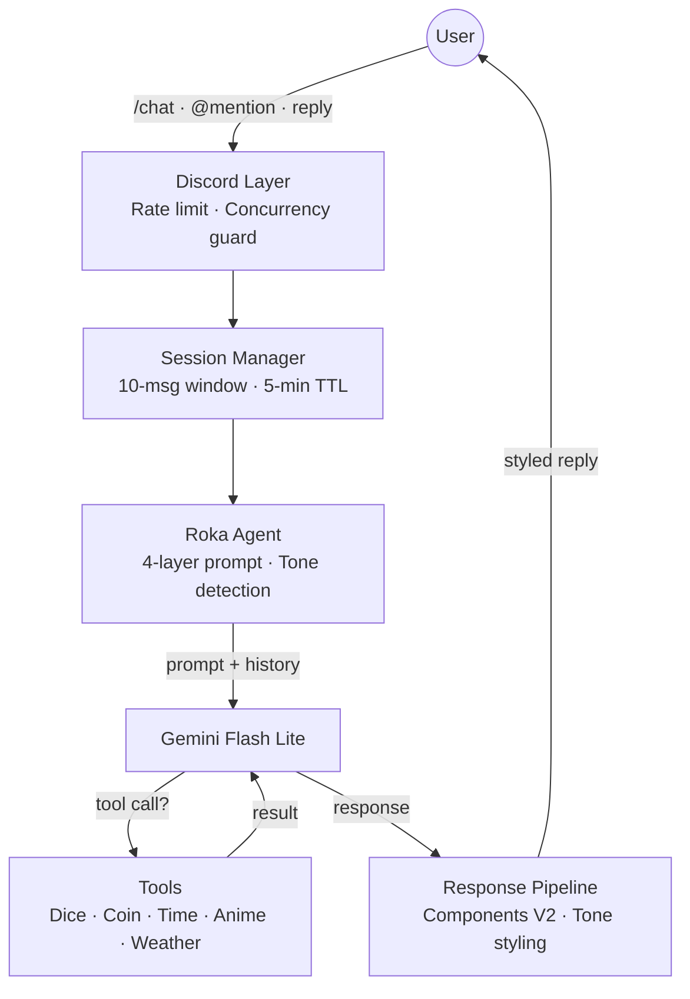
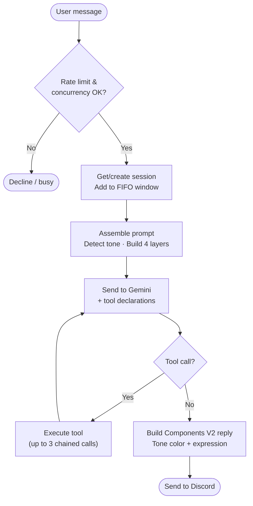
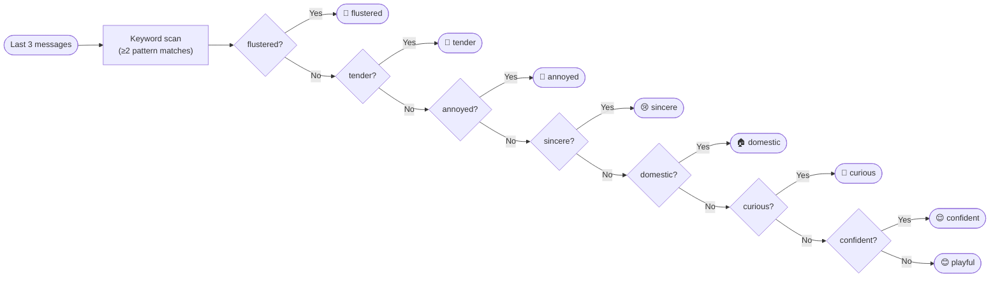
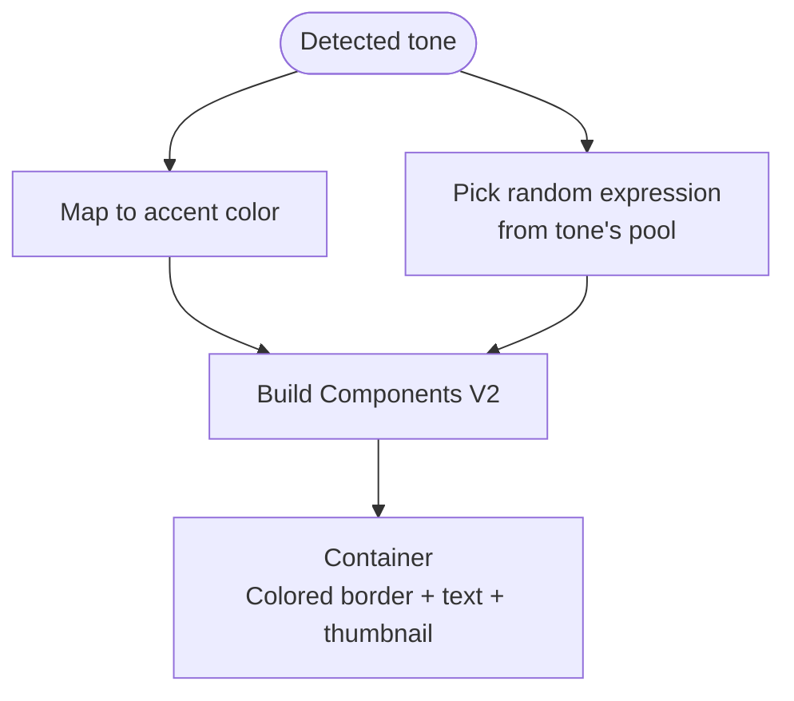

<p align="center">
  
</p>

<h1 align="center">Rokabot</h1>

<p align="center">
  A server-wide Discord character chatbot embodying <strong>Maniwa Roka</strong> from <em>Senren*Banka</em>,<br/>
  powered by Gemini Flash Lite via Google ADK TypeScript.
</p>

<p align="center">
  
  
  
  
  
</p>

---

Rokabot responds to `/chat` slash commands, @mentions, and replies with in-character dialogue. It can also perceive images attached to messages via Gemini's multimodal input. It maintains per-channel conversational memory using a 10-message sliding window with a 5-minute idle TTL. A 4-layer prompt system drives personality, speech patterns, dynamic tone selection, and channel awareness — all running within a ~1000-1600 token system prompt budget.

All state is in-memory with no persistence. Bot restart = clean slate.

## Requirements

### Hardware

| Component | Minimum                                        | Recommended                     |
| --------- | ---------------------------------------------- | ------------------------------- |
| Board     | Any ARM64/x86_64 host                          | Raspberry Pi 5 (8 GB) or better |
| RAM       | 256 MB free                                    | 512 MB free                     |
| Storage   | ~200 MB (image + deps)                         | 1 GB                            |
| Network   | Stable internet (Discord Gateway + Gemini API) | Wired Ethernet                  |

### Software

| Dependency              | Version                                      |
| ----------------------- | -------------------------------------------- |
| Node.js                 | >= 24.13.0                                   |
| npm                     | >= 10                                        |
| Docker + Docker Compose | Latest stable (for containerized deployment) |
| Git                     | Any recent version                           |

### API Keys

| Service                       | Where to get it                                                         |
| ----------------------------- | ----------------------------------------------------------------------- |
| Discord Bot Token + Client ID | [Discord Developer Portal](https://discord.com/developers/applications) |
| Gemini API Key                | [Google AI Studio](https://aistudio.google.com/apikey)                  |

The Discord application requires the **Message Content** privileged intent enabled.

---

## Installation

### 1. Clone and install

```bash
git clone https://github.com/AlaskanTuna/rokabot.git
cd rokabot
npm ci
```

### 2. Configure secrets

```bash
cp .env.example .env
```

Edit `.env` with your credentials:

```env
DISCORD_TOKEN=your_discord_bot_token
DISCORD_CLIENT_ID=your_discord_client_id
GEMINI_API_KEY=your_gemini_api_key
```

### 3. Configure tunables (optional)

Edit `config.yml` to adjust rate limits, session behavior, model, or logging level. Environment variables can override any YAML value for backward compatibility.

### 4. Run

**Development (hot reload):**

```bash
npm run dev
```

**Production (compiled):**

```bash
npm run build
npm start
```

**Docker:**

```bash
docker compose up -d
```

---

## Configuration

Secrets live in `.env`, tunables live in `config.yml`.

| YAML Path                  | Env Override                 | Default                         | Description                       |
| -------------------------- | ---------------------------- | ------------------------------- | --------------------------------- |
| `gemini.model`             | `GEMINI_MODEL`               | `gemini-3.1-flash-lite-preview` | Gemini model name                 |
| `gemini.timeout`           | `GEMINI_TIMEOUT`             | `15000`                         | Request timeout (ms)              |
| `gemini.maxRetries`        | `GEMINI_MAX_RETRIES`         | `1`                             | Max retries for transient errors  |
| `rateLimit.rpm`            | `RATE_LIMIT_RPM`             | `15`                            | Requests per minute               |
| `rateLimit.rpd`            | `RATE_LIMIT_RPD`             | `500`                           | Requests per day                  |
| `session.ttl`              | `SESSION_TTL_MS`             | `300000`                        | Idle session TTL (ms)             |
| `session.windowSize`       | `SESSION_WINDOW_SIZE`        | `10`                            | FIFO message window size          |
| `discord.maxMessageLength` | `DISCORD_MAX_MESSAGE_LENGTH` | `2000`                          | Discord message char limit        |
| `logging.level`            | `LOG_LEVEL`                  | `info`                          | Log level (debug/info/warn/error) |

---

## High-Level Architecture



### End-to-End Pipeline

How user (client) prompts go through the system (backend) and transform plain messages into rich, character-personalized replies:



### Tone Detection

The tone detector scans the last 3 messages for keyword matches (zero LLM cost):



### Tone Styling

After tone detection, the response pipeline maps the detected tone to a visual style (accent color + character expression):



| Tone         | Color              | Expression Pool                   |
| ------------ | ------------------ | --------------------------------- |
| 😊 playful   | `#FFB3D9` pink     | smile, cheerful, delighted        |
| 😢 sincere   | `#A8D8FF` blue     | sad, downcast, melancholy         |
| 🏠 domestic  | `#FFD4B5` peach    | gentle smile, content, serene     |
| 🫣 flustered | `#FFB3B3` red      | flustered, nervous, awkward       |
| 🤔 curious   | `#B2EBF2` cyan     | thinking, surprised, blank stare  |
| 😤 annoyed   | `#F8B4B8` rose     | exasperated, frustrated, resigned |
| 🥹 tender    | `#E1BEE7` lavender | worried, troubled, gentle smile   |
| 😌 confident | `#C8E6C9` mint     | composed, explaining, attentive   |

---

## Project Structure

```
rokabot/
├── src/
│   ├── index.ts                       # Entry point, signal handling, graceful shutdown
│   ├── config.ts                      # Config loader (.env secrets + config.yml tunables)
│   ├── agent/
│   │   ├── roka.ts                    # Gemini API integration, function calling loop
│   │   ├── toneDetector.ts            # Rule-based tone detection (keyword matching)
│   │   ├── promptAssembler.ts         # 4-layer prompt combiner
│   │   ├── prompts/
│   │   │   ├── core.ts                # Layer 0: Core identity & personality
│   │   │   ├── speech.ts              # Layer 1: Speech patterns & formatting rules
│   │   │   ├── tones.ts               # Layer 2: Tone variants (8 moods)
│   │   │   └── context.ts             # Layer 3: Dynamic context (time, participants)
│   │   ├── tools/
│   │   │   ├── index.ts               # Tool declarations + dispatcher
│   │   │   ├── rollDice.ts            # NdM dice roller
│   │   │   ├── flipCoin.ts            # Coin flip
│   │   │   ├── getCurrentTime.ts      # Timezone-aware clock
│   │   │   ├── searchAnime.ts         # Jikan anime search (sort, filter, limit)
│   │   │   ├── getAnimeSchedule.ts    # Jikan schedule (day/week/season scope)
│   │   │   ├── getWeather.ts          # Open-Meteo weather lookup
│   │   │   └── jikanThrottle.ts       # Jikan API rate limiter (3 req/s)
│   │   └── __tests__/                 # Agent + tool tests
│   ├── discord/
│   │   ├── client.ts                  # discord.js client setup (intents, partials)
│   │   ├── concurrency.ts             # Per-channel concurrency guard
│   │   ├── responses.ts               # In-character message pools
│   │   ├── commands/
│   │   │   ├── chat.ts                # /chat slash command
│   │   │   └── tools.ts               # Tool slash commands (/anime, /schedule, etc.)
│   │   ├── events/
│   │   │   ├── ready.ts               # Bot login, command registration
│   │   │   ├── interactionCreate.ts   # Slash command router
│   │   │   ├── messageCreate.ts       # @mention and reply handler
│   │   │   └── toolCommands.ts        # Tool command handlers + pagination
│   │   └── __tests__/                 # Response utilities tests
│   ├── session/
│   │   ├── types.ts                   # WindowMessage & ChannelSession interfaces
│   │   ├── messageWindow.ts           # FIFO message buffer (push/evict)
│   │   ├── sessionManager.ts          # Per-channel session lifecycle + idle TTL
│   │   └── __tests__/                 # Session tests
│   └── utils/
│       ├── logger.ts                  # pino structured logger
│       ├── rateLimiter.ts             # Token bucket (RPM) + daily counter (RPD)
│       └── __tests__/                 # Rate limiter tests
├── scripts/
│   └── test-chat.ts                   # CLI test script for rapid prompt iteration
├── assets/
│   ├── roka-character-bible.md        # Comprehensive character reference
│   └── app-icon.jpg                   # Bot avatar
├── config.yml                         # Tunable configuration (non-secret)
├── .env.example                       # Environment variable template
├── Dockerfile                         # Multi-stage build (build + slim runtime)
├── docker-compose.yml                 # Single service, 512 MB mem cap, log rotation
├── tsconfig.json                      # TypeScript compiler config
├── .eslintrc.cjs                      # ESLint config
├── .prettierrc                        # Prettier config
├── vitest.config.ts                   # Vitest test runner config
└── package.json                       # Dependencies & scripts
```

---

## Commands

```bash
# Development
npm run dev            # Start with tsx watch (hot reload)
npm run test:chat      # CLI chat test (no Discord needed)

# Build & Run
npm run build          # Compile TypeScript to dist/
npm start              # Run compiled JS (production)

# Quality
npm run lint           # ESLint
npm run format         # Prettier (write)
npm run format:check   # Prettier (check only)
npm test               # Run all tests
npm run test:watch     # Tests in watch mode

# Docker
docker compose build   # Build image
docker compose up -d   # Run containerized
docker compose logs -f # Tail logs
```

---

## Docker Deployment

The Dockerfile uses a multi-stage build: stage 1 compiles TypeScript with all dev dependencies, stage 2 copies only the compiled output and production dependencies into a slim `node:24-alpine` image.

```bash
docker compose up -d
```

| Setting          | Value             |
| ---------------- | ----------------- |
| Base image       | `node:24-alpine`  |
| Memory limit     | 512 MB            |
| Expected runtime | ~80-150 MB        |
| Restart policy   | `unless-stopped`  |
| Log rotation     | 10 MB x 3 files   |
| Process user     | `node` (non-root) |

The image builds natively on ARM64 (Raspberry Pi 5) with no cross-compilation needed.

---

## License

MIT. 2026.

---
